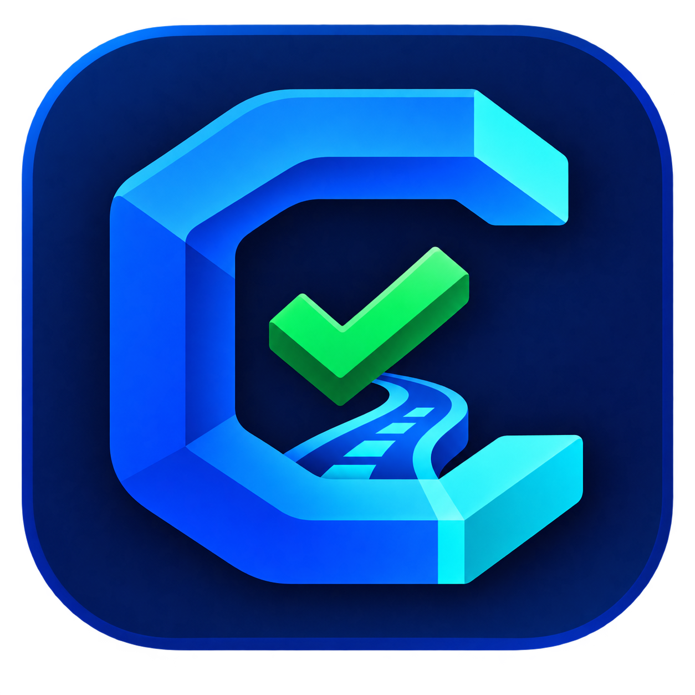

<div align="center">
  
  <h1>CodeGate Leader</h1>
  <p><strong>先把产品和赛题想清楚，再让 Coding Agent 写代码。</strong></p>
  <p>一个独立于模型与 Agent 的本地技术负责人工作台：需求澄清、架构决策、动态计划、Agent Prompt、真实证据审查与纠偏。</p>

  [](https://github.com/Ssen-ai1/codegate-leader/actions/workflows/ci.yml)
  [](LICENSE)
  [](https://nodejs.org/)
  [](#安装与运行)
  [](https://github.com/Ssen-ai1/codegate-leader/releases)
</div>

> **Alpha 提示：** 当前版本适合开发者体验、研究和共建。Windows 安装包尚未进行正式代码签名，商业发行所需的法律文本、更新服务和授权服务也尚未部署。

## 为什么需要 CodeGate Leader

Codex、Claude Code 等 Coding Agent 已经很会写代码，但复杂项目失败往往不是因为代码写得慢，而是因为：

- 任务一开始只有一句模糊想法，Agent 在需求没有确定时就开始实现；
- 架构选择没有记录，后续会话或不同 Agent 使用了互相冲突的假设；
- 长任务被一次性塞进 Prompt，范围扩大、遗漏交付物或反复重写；
- Agent 说“已经完成”，但没有真实 Diff、测试结果和可追踪验收证据；
- 用户不知道当前在哪一步、为什么做这一步、下一步应该交给谁；
- 比赛用户面对几十页赛题指南，却需要自己找基础分、高阶项、板卡限制和评分指标。

CodeGate Leader 在用户与 Coding Agent 之间增加一个稳定的“技术负责人层”。它不替代 Agent，也不盲目自动执行代码，而是把目标、决策、计划和证据沉淀成可恢复、可审计的工程工件。

```text
产品想法 / 官方赛题 / 已有工程
              │
              ▼
    引导澄清 + 事实来源追踪
              │
              ▼
 TaskSpec / 得分地图 / 架构决策
              │
              ▼
  动态 WorkPlan + 单步 Agent Prompt
              │
              ▼
     Codex / Claude Code / 其他 Agent
              │
              ▼
 Execution Report + 真实 Diff + 本地验证
              │
              ▼
 独立 Review → 接受 / 最小纠偏 / 用户决策
```

## 最值得体验的特点

| 特点 | CodeGate Leader 的做法 | 带来的价值 |
|---|---|---|
| 从一句想法开始 | 通过逐题访谈补齐用户、MVP、平台、数据、成功标准和约束 | 不需要用户先会写专业需求文档 |
| 从官方赛题开始 | 解析 PDF、Word、Markdown、文本或图片，列出具体赛题并提取得分项 | 学生先看懂题，再决定技术路线 |
| 用户确认优先 | 未明确赛题、板卡或阻塞问题时，禁止生成计划和 Prompt | 不让关键词分类或模型猜测替代事实 |
| 模型与 Agent 解耦 | Leader 模型、Reviewer 模型和执行 Agent 可以分别配置 | 可在 Codex、Claude Code及兼容模型之间切换 |
| 一次只交接一步 | 将当前 PlanStep 编译成范围受控的 Agent Prompt | 降低长任务偏航和无关重写 |
| 声明不等于验收 | Agent 报告只是输入，CodeGate 重新读取工作区并运行已确认验证 | “看起来完成”不会直接变成 Accepted |
| 交接基线 | Handoff 前保存 Git/文件基线，区分旧修改与本轮修改 | Review 知道哪些成果真正来自当前执行 |
| 版本化工程记忆 | TaskSpec、ADR、Plan、Handoff、Review 和事件链保留历史 | 重启、更换模型或跨 Agent 后仍可恢复 |
| 调试快车道 | 局部错误只生成最小修复 Prompt，不重写正式冲刺计划 | 适合比赛和高频调试场景 |
| Mentor 与答辩 | 解释数据流、时序、资源与验证边界，并生成项目专属答辩题 | 不只得到代码，还能理解和讲清楚方案 |

## 两种产品模式

### 产品开发模式

适合独立开发者、创业者和小团队。从一句产品想法开始，按以下阶段推进：

```text
产品定义 → 技术架构 → 开发计划 → Agent 执行 → 验证审查 → 完成交付
```

CodeGate 会建立七类产品蓝图：目标、用户、MVP/非目标、运行平台、数据与外部集成、成功标准、商业与交付约束。前三个阶段可回看和版本化修订；影响后续执行的修改会先展示影响，并使相关旧计划显式失效。

### FPGA / 嵌入式竞赛模式

适合面对正式赛题 PDF、板卡约束和现场答辩的学生团队：

```text
赛题拆解 → 实现路线 → 冲刺计划 → AI 执行 → 上板验收 → 提交答辩
```

竞赛模式会：

1. 从多题指南中识别并列出具体题目；
2. 要求用户明确选择赛题编号和完整题名；
3. 提取基础要求、高阶挑战、板卡、工具链、性能指标、提交物和现场要求；
4. 确认真实板卡、工具安装和当前已跑通进度；
5. 比较保底、平衡、冲刺三类路线；
6. 生成“环境—最小闭环—基础分—高阶优化—现场鲁棒—提交答辩”计划；
7. 记录 CoreMark、频率、资源、FPS、准确率等测量值；
8. 支持调试快车道、得分地图、竞赛导师和模拟答辩。

如果没有识别到具体赛题，或者旧项目只记录了赛事名称，系统会停止推进，而不是把整本指南猜成某一道题。相关修复审计见 [ALPHA9_SELECTION_GATE_AUDIT.md](ALPHA9_SELECTION_GATE_AUDIT.md)。

## 安装与运行

### 环境要求

- Windows 10/11（桌面版当前主要支持平台）
- Node.js 22+
- npm
- 可选：Codex CLI 或 Claude Code
- 可选：任何兼容 OpenAI Chat Completions 请求格式的 Leader 模型服务

### 5 分钟从源码运行

```powershell
git clone https://github.com/Ssen-ai1/codegate-leader.git
cd codegate-leader
npm ci
npm run check
npm run desktop
```

首次打开后：

1. 点击“新建项目”或“打开已有项目”；
2. 选择“产品开发”或“FPGA / 嵌入式竞赛”；
3. 产品模式输入一句想法，竞赛模式导入官方赛题资料；
4. 按页面中央的唯一主要操作逐步确认事实；
5. 选择架构路线并批准计划；
6. 在 Agent 执行阶段生成 Prompt，复制或打开本机 Agent；
7. Agent 完成后导入 Execution Report，让 CodeGate 验证和 Review。

### 构建 Windows 安装包

```powershell
npm run package:win
npm run smoke:packaged
```

安装包输出到 `release/`。当前开源 Alpha 构建默认未启用发行商代码签名；请勿把本机构建误认为正式商业发行版本。

## 完整工作技术流程

### 1. Intake：把资料变成可追踪事实

输入可以是一句话、已有仓库、Markdown/TXT、PDF、DOCX 或图片。解析出的需求、约束、交付物和验收标准都保存 SourcePointer，记录来源文件、位置和内容哈希。

输出包括 `TaskSpec`、产品蓝图或竞赛得分地图、阻塞问题与用户答案、原始资料归档。

### 2. Architecture：比较后再决定

系统根据任务、平台、环境和约束展示三种技术路线，包含速度、成本、风险、适用场景、优势和代价。只有用户确认的方案才写入 Architecture Decision Record；系统不会把推荐自动当作批准。

### 3. Plan：把目标拆成可验收步骤

动态 Planner 生成 3～8 个步骤。每步带有依赖、范围、需求映射、交付物、验收项、推荐方法、预期输出、验证方法、风险与停止条件。批准前检查循环依赖、无效引用和必需验收覆盖。

### 4. Handoff：把当前一步编译成 Agent Prompt

CodeGate 只交接当前依赖已满足的步骤，并在交接前保存工作区基线。Prompt 固定包含唯一目标、已批准架构、范围/非目标、已知环境、质量门槛、验证要求、停止条件和 Execution Report Contract。

### 5. Agent Execution：执行与管理解耦

Codex、Claude Code 或其他 Agent 在目标工程中完成当前步骤。CodeGate 不冒充 Coding Agent，也不在用户不知情时自动执行外部操作。执行 Agent 必须返回结构化报告，说明改动、命令、输出、风险与需求映射。

### 6. Evidence Review：重新验证，不相信口头完成

CodeGate 将执行报告与交接基线、真实文件变化、Git Diff、输出哈希和自己运行的验证命令对照。Agent 自报日志不会自动获得可信状态；只有 CodeGate 重新执行并绑定到当前 Handoff 的结果才能作为强证据。

### 7. Correct / Decide：最小纠偏或交还用户决策

局部缺陷生成 Correction Handoff，只允许修复 Review 指定问题。架构变化、范围扩大、事实冲突或重复偏航会进入 UserDecisionRequest，由用户选择接受现状、要求纠偏、更新计划或阻塞项目。

更详细的流程、状态机和工件说明见 [docs/WORKFLOW.md](docs/WORKFLOW.md)，技术架构见 [docs/ARCHITECTURE.md](docs/ARCHITECTURE.md)。

## 项目数据放在哪里

每个被管理的项目会生成本地 `.codegate/` 工作区：

```text
.codegate/
├─ manifest.json                 # 协议与产品版本
├─ state.json                    # 当前阶段
├─ task/                         # TaskSpec 和原始资料
├─ architecture/decisions/       # ADR 历史
├─ plan/                         # WorkPlan 与 PlanPatch
├─ handoffs/                     # Agent Prompt / Handoff
├─ agent-reports/                # 执行报告与附件
├─ reviews/                      # 独立审查
├─ verification/                 # CodeGate 自运行验证
├─ assistant/                    # 项目级 Leader 对话
└─ events.jsonl                  # 哈希链事件日志
```

API Key 和许可证 Token 不会写入项目目录。桌面端使用 Electron `safeStorage` 和操作系统安全存储；模型输入还会进行字段级及内容级脱敏。

## 模型配置

不配置模型也可以使用资料解析、动态计划、确定性证据审查、CLI 和 Desktop。本地规则不足以回答的问题会明确提示，而不是虚构模型输出。

桌面端推荐在“设置”中配置。CLI/开发环境也支持：

```powershell
$env:CODEGATE_LEADER_API_KEY = "<your-key>"
$env:CODEGATE_LEADER_BASE_URL = "https://api.openai.com/v1"
$env:CODEGATE_LEADER_MODEL = "<leader-model>"
$env:CODEGATE_LEADER_REVIEW_MODEL = "<independent-review-model>"
```

请不要把真实 Key 写进仓库、任务资料或截图。

## CLI 快速参考

```text
codegate init
codegate intake task.md
codegate leader-analyze "补充背景"
codegate clarify <questionId> <answer>
codegate approve-task
codegate architecture <title> <confirmed-decision>
codegate plan
codegate approve-plan
codegate next --agent codex
codegate ingest report.json
codegate confirm-environment
codegate verify "<已确认的精确命令>" --yes
codegate review report.json
codegate correct --agent claude
codegate decide <decisionId> <accept-current|request-correction|update-plan|block>
codegate reopen-task <reason>
codegate explain
codegate evaluate golden-results.json
```

## 开发、测试与可信边界

```powershell
npm run build          # TypeScript 构建
npm test               # 全部测试
npm run check          # 构建 + 测试
npm run desktop        # 运行桌面端
npm run package:win    # 构建 NSIS 安装包
npm run smoke:packaged # 打包产物冒烟测试
npm run release:check  # 商业发布硬门检查
```

当前测试覆盖协议 Schema、资料解析、动态计划、状态机、工作区基线、可信验证、范围扩大、PlanPatch、事件链、设置安全、许可证验证、Desktop E2E、竞赛模式和 Golden 场景。

CodeGate 的边界同样重要：

- 它不会证明业务需求本身正确；用户仍需确认关键目标与取舍。
- 它不会把 Agent 的声明当作验收。
- 它不会绕过用户许可执行外部或破坏性操作。
- 它不能替代真实用户测试、硬件上板或正式安全审计。
- 当前 Alpha 未达到签名商业发行条件，`npm run release:check` 会如实阻止。

## 文档导航

- [快速上手](docs/QUICKSTART.md)
- [完整工作流与状态机](docs/WORKFLOW.md)
- [技术架构](docs/ARCHITECTURE.md)
- [常见问题](docs/FAQ.md)
- [产品与技术全景介绍](CODEGATE_LEADER_PRODUCT_TECHNICAL_OVERVIEW.md)
- [Alpha 技术交接](ALPHA_TECHNICAL_HANDOFF.md)
- [稳定性审计](STABILITY_AUDIT.md)
- [竞赛模式发布审计](ALPHA8_COMPETITION_RELEASE_AUDIT.md)
- [赛题身份门禁审计](ALPHA9_SELECTION_GATE_AUDIT.md)
- [隐私数据地图](PRIVACY_DATA_MAP.md)

## 参与贡献

欢迎提交 Bug、产品体验建议、新赛题解析器、Agent 适配器、验证器和文档改进。开始前请阅读 [CONTRIBUTING.md](CONTRIBUTING.md) 和 [CODE_OF_CONDUCT.md](CODE_OF_CONDUCT.md)。安全问题请不要公开提交 Issue，参见 [SECURITY.md](SECURITY.md)。

## 开源许可证

CodeGate Leader 源码采用 [Apache License 2.0](LICENSE)。你可以使用、研究、修改和分发源码，但需要保留许可证和版权声明。仓库中的未来托管服务/商业发行接口文档不改变开源代码的许可证；第三方依赖分别遵循其自身许可证。

如果这个项目对你有帮助，欢迎 Star、试用、提交真实使用反馈，或者带着你的产品想法与赛题一起参与共建。
